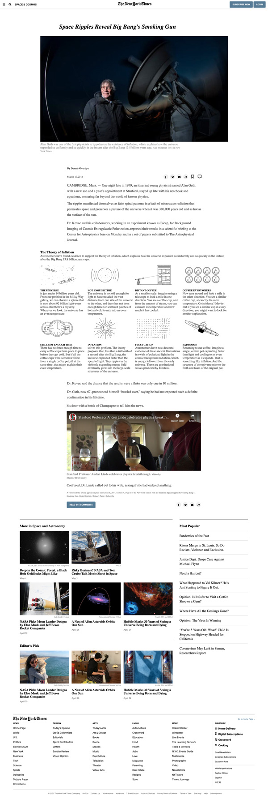

# New York Times Article Page Clone

> In this project, my partner and I explored the different positioning skills ranging from inline-block, floats, position, flex, and grid.
> We gained a deeper understanding of how to position and properly layout elements on the page.
> We combined these different methods to achieve our goals by reproducing the clone of the [New York Times Article page](https://www.nytimes.com/2014/03/18/science/space/detection-of-waves-in-space-buttresses-landmark-theory-of-big-bang.html?_r=0).

> One of our major challenges in this project was when we positioned a sprite image under where we have "The Theory of Inflation".

> In the course of the project, we learned and mastered the use of advanced CSS selectors which we used in styling most of the elements.

> We also worked on the responsive part of the page to fit into different screen sizes employing the media query techniques.



This project covers the following HTML and CSS3 concepts

- Embedding images
- Working with forms (buttons in this case)
- Floats and positioning
- The box model
- CSS Advance Selectors
- Flex and Grid

## Built With

- HTML
- CSS
- Google fonts
- Font Awesome

## Live Demo

[Live Demo Link](https://acushlakoncept.github.io/newyork_times_clone/)

## Getting Started

To get a local copy of the repository please run the following commands on your terminal:

```
$ cd <folder>
```

```
$ git clone https://github.com/acushlakoncept/newyork_times_clone.git
```

## Authors

**Uduak Essien**

- Github: [@acushlakoncept](https://github.com/acushlakoncept/)
- Twitter: [@acushlakoncept](https://twitter.com/acushlakoncept)
- Linkedin: [acushlakoncept](https://www.linkedin.com/in/acushlakoncept/)

👤 **Lucas Delbel**

- Github: [@ldelbel](https://github.com/ldelbel)
- Twitter: [@delbel_lucas](https://twitter.com/delbel_lucas)
- Linkedin: [lucasdelbel](https://www.linkedin.com/in/lucasdelbel/)

## 🤝 Contributing

Contributions, issues and feature requests are welcome!

Feel free to check the [issues page](https://github.com/acushlakoncept/newyork_times_clone/issues).

## Show your support

Give a ⭐️ if you like this project!

## Acknowledgments

- Project originally taken from The Odin Project
- Project inspired by Microverse Program
